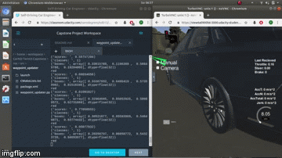

##  Udacity SDCE Term 3 Capstone Project

This is the project repo for the final project of the Udacity Self-Driving Car Nanodegree: Programming a Real Self-Driving Car. For more information about the project, see the project introduction [here](https://classroom.udacity.com/nanodegrees/nd013/parts/6047fe34-d93c-4f50-8336-b70ef10cb4b2/modules/e1a23b06-329a-4684-a717-ad476f0d8dff/lessons/462c933d-9f24-42d3-8bdc-a08a5fc866e4/concepts/5ab4b122-83e6-436d-850f-9f4d26627fd9).

### Introduction and Motivation

This repository contains the solution for the last project of Udacity's SDCE program. For a successful passing of this project it is necessary that our car behaves correctly in the simulator. For the implementation teams could be formed or worked individually. I decided to work individually. The reasons for this were for me on the one hand the enormous feeling of success to have managed it alone, rather and more importantly however to visit many topics again and to strengthen the knowledge there. The support of Udacity by walktrough videos and a workspace in the browser let me hope not to spend too much time with setups. 
Since testing the software under real conditions is reserved for teams, I concentrated on the simulator project right from the start.


[Full YouTube video can be found here!](https://www.youtube.com/watch?v=4pUlswlbl8k&feature=youtu.be)

### System Architecture

The following diagram illustrates the system architecture. Basis is the so-called ROS - Robot Operation System (visit http://www.ros.org/ for more information). Messages and modules are now called Nodes and Topics. 


*(Image Source: Udacity)*

#### Twist Controller / DBW Node

This node  calculates:

- Throttle
- Brake and 
- Steering angle 

**-> to follow a longitudinal and lateral trajectory **
 
I use a PID controller to calculate throttle and brake. Basis difference between the target velocity and current velocity. 


*(Image Source: Udacity)*

#### Waypoint Loader

Loads waypoints from a CSV file and makes them available to other components.

#### Waypoint Follower

This node determine the target yawrate to keep the lane. The (longitudinal) target velocity is set in Waypoint Updater node.

#### Waypoint Updater

The waypoint updater:

- is updating the target velocity of each waypoint based on traffic light data. 
- **case 1:** Target velocity  is provided from the Waypoint Loader node. 
- **case 2:** If a red traffic light is detected a  stopping trajectory respecting defined deceleration limits is generated.


*(Image Source: Udacity)*

#### Traffic Light Detector

This was the most challenging component for me. The following approaches were followed:

1) The camera image is evaluated with the help of classical image processing. Color space change, edge detection to know the position of the traffic light, histogram of red pixels, ...

**--> Probably very unreliable. Much effort to implement and error-prone.**

2)  You use an existing, well-trained CNN. For example SSD or RCNN. If they have been trained against the COCO data set, a traffic light is detected (but not the state). The result is so-called bounding boxes for a label ID (e.g. 10 for COCO).
The traffic light sample can therefore be cropped out and evaluated using the methods mentioned in point 1. I call this the hybrid approach.

**--> I had implemented this as a test and the results were quite satisfactory. But the integration was difficult and because of the classical image processing algorithms the speediness of CNN is partly destroyed.**

3) The implementation of the final solution has been given its own repository:
https://github.com/patdring/CarND-Term3-TrafficLightDetection
Here the approach of **Transfer Learning** is implemented. The understanding and code (tools to (re-)train, extract and freeze graphs) is based on the great work that can be found at https://github.com/tensorflow/models/tree/master/research/object_detection.
This was done to teach the CNN not only traffic lights, but also their status red, yellow or green:

a) Create a **labeld dataset**. I stored a lot of camera images from simulator and put dem in a dir. structur. You can find them [here](https://github.com/patdring/CarND-Term3-TrafficLightDetection/tree/master/transfer_learning/sim_dataset). Now you have to label them. This can be done with [LabelImg](https://github.com/tzutalin/labelImg). Result is a XML file which contains boxes with coords. of images traffic lights and its color.

b) Create a **TFRecord **file to retrain a TensorFlow model. A TFRecord is a binary file format which stores your images and ground truth annotations. Create also label_map.pbtxt file which contains the labels for red, yellow, green and unknown.

c) Choose a model and configure it. I choose a SSD Inception V2 mode trained against Coco dataset. From TensoFlows repo. you have to copy the according config file. And adjust there some paths and of epochs. The example there uses 200.000 epochs to retrain a network to detect pets. Way too much in my opionion. The simulator generates "perfect" and not so different images. I was statisfied with the already after ~1500 epochs. It's also important to keep in mind to keep your model (file) small.

d) Train and freeze your model. Include it in your project like I did [here(https://github.com/patdring/CarND-Term3-Capstone/blob/master/ros/src/tl_detector/light_classification/tl_classifier.py).


*(Image Source: Udacity)*

### Conclusion

The biggest challenge in this project was certainly the status recognition of traffic lights. Several solutions were devised and implemented. The actual control of the car was quickly understood and implemented due to previous projects and excellent walktrough videos. Also the integration of the recognition into the project was time-consuming. The newly gained knowledge about an implementation in the simulator makes the results of large companies like Waymo even more breathtaking.
The procedure described for Transfer Learning is deliberately very simplified. Only the installation of TensorFlow can use own articles. But with the suitable git repo. link you have a good starting point and suitable examples.

### Miscellaneous 

This project is hardware dependent when the camera is switched on in the simulator. This was also the impression I had after numerous (Udacity internal) forum visits. A hint at this point is to adjust the ROS refresh rates in the individual modules or to process only every nth image in case of different unexpected behavior. I spent hours trying to find a stable solution for myself.

### Original README ...
Please use **one** of the two installation options, either native **or** docker installation.

### Native Installation

* Be sure that your workstation is running Ubuntu 16.04 Xenial Xerus or Ubuntu 14.04 Trusty Tahir. [Ubuntu downloads can be found here](https://www.ubuntu.com/download/desktop).
* If using a Virtual Machine to install Ubuntu, use the following configuration as minimum:
  * 2 CPU
  * 2 GB system memory
  * 25 GB of free hard drive space

  The Udacity provided virtual machine has ROS and Dataspeed DBW already installed, so you can skip the next two steps if you are using this.

* Follow these instructions to install ROS
  * [ROS Kinetic](http://wiki.ros.org/kinetic/Installation/Ubuntu) if you have Ubuntu 16.04.
  * [ROS Indigo](http://wiki.ros.org/indigo/Installation/Ubuntu) if you have Ubuntu 14.04.
* [Dataspeed DBW](https://bitbucket.org/DataspeedInc/dbw_mkz_ros)
  * Use this option to install the SDK on a workstation that already has ROS installed: [One Line SDK Install (binary)](https://bitbucket.org/DataspeedInc/dbw_mkz_ros/src/81e63fcc335d7b64139d7482017d6a97b405e250/ROS_SETUP.md?fileviewer=file-view-default)
* Download the [Udacity Simulator](https://github.com/udacity/CarND-Capstone/releases).

### Docker Installation
[Install Docker](https://docs.docker.com/engine/installation/)

Build the docker container
```bash
docker build . -t capstone
```

Run the docker file
```bash
docker run -p 4567:4567 -v $PWD:/capstone -v /tmp/log:/root/.ros/ --rm -it capstone
```

### Port Forwarding
To set up port forwarding, please refer to the [instructions from term 2](https://classroom.udacity.com/nanodegrees/nd013/parts/40f38239-66b6-46ec-ae68-03afd8a601c8/modules/0949fca6-b379-42af-a919-ee50aa304e6a/lessons/f758c44c-5e40-4e01-93b5-1a82aa4e044f/concepts/16cf4a78-4fc7-49e1-8621-3450ca938b77)

### Usage

1. Clone the project repository
```bash
git clone https://github.com/udacity/CarND-Capstone.git
```

2. Install python dependencies
```bash
cd CarND-Capstone
pip install -r requirements.txt
```
3. Make and run styx
```bash
cd ros
catkin_make
source devel/setup.sh
roslaunch launch/styx.launch
```
4. Run the simulator

### Real world testing
1. Download [training bag](https://s3-us-west-1.amazonaws.com/udacity-selfdrivingcar/traffic_light_bag_file.zip) that was recorded on the Udacity self-driving car.
2. Unzip the file
```bash
unzip traffic_light_bag_file.zip
```
3. Play the bag file
```bash
rosbag play -l traffic_light_bag_file/traffic_light_training.bag
```
4. Launch your project in site mode
```bash
cd CarND-Capstone/ros
roslaunch launch/site.launch
```
5. Confirm that traffic light detection works on real life images
